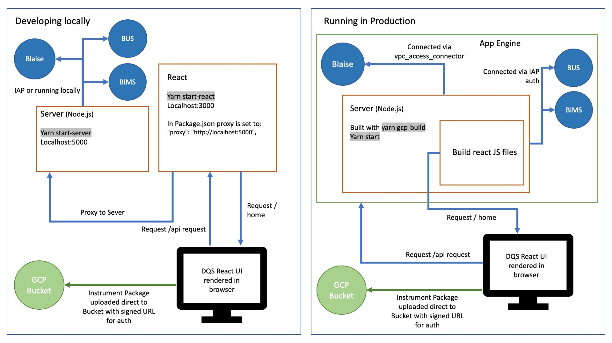
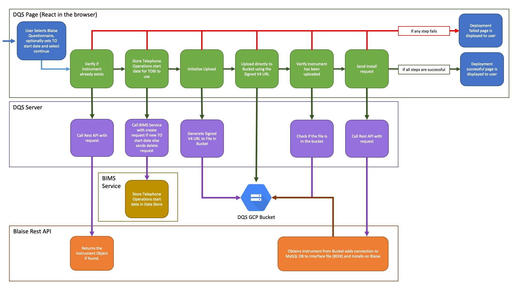

# Deploy Questionnaire Service

[](https://codecov.io/gh/ONSdigital/blaise-deploy-questionnaire-service)
[](https://github.com/ONSdigital/blaise-deploy-questionnaire-service/workflows/Test%20coverage%20report/badge.svg)

[](https://github.com/ONSdigital/blaise-deploy-questionnaire-service/pulls)
[](https://github.com/ONSdigital/blaise-deploy-questionnaire-service/commits)
[](https://github.com/ONSdigital/blaise-deploy-questionnaire-service/graphs/contributors)
[](https://lgtm.com/projects/g/ONSdigital/blaise-deploy-questionnaire-service/context:javascript)
[](https://lgtm.com/projects/g/ONSdigital/blaise-deploy-questionnaire-service/alerts/)

Service for uploading Questionnaire files to Blaise.

This is done by uploading the Questionnaire package to a GCP Bucket then sending a request to
the [Blaise Rest API](https://github.com/ONSdigital/blaise-api-rest) to install it onto Blaise.

This project is a React application which when built is rendered by a Node.js express server. The Node.js handles the
file being uploaded from the client and uploads the file to a GCP bucket using
the [@google-cloud/storage module](https://www.npmjs.com/package/@google-cloud/storage).



### Questionnaire package upload process



[Blaise Questionnaire Metadata Service (BIMS)](https://github.com/ONSdigital/blaise-instrument-metadata-service) handles
storing Instrument Metadata like the Telephone Operations start date used
by [Telephone Operations Blaise Interface (TOBI)](https://github.com/ONSdigital/telephone-operations-blaise-interface).

[Blaise UAC Service (BUS)](https://github.com/ONSdigital/blaise-uac-service) handles the generation of Unique Access
Codes (UACs) for Questionnaires.

### Setup

#### Prerequisites

To run Blaise Deploy Questionnaire Service locally, you'll need to have [Node installed](https://nodejs.org/en/), as
well as [yarn](https://classic.yarnpkg.com/en/docs/install#mac-stable).

To have the list of Questionnaires load on the page, you'll need to
have [Blaise Rest API](https://github.com/ONSdigital/blaise-api-rest) running locally (On a Windows machine), or you
can [create an Identity-Aware Proxy (IAP) tunnel](https://cloud.google.com/sdk/gcloud/reference/compute/start-iap-tunnel)
from a GCP Compute Instance running the rest API in a sandbox. An example command to connect to the rest api VM on local
port `5011`:

```shell
sudo gcloud compute start-iap-tunnel restapi-1 80 --local-host-port=localhost:5011 --zone europe-west2-a
```

### Local Setup

Prerequisites
- [Node.js](https://nodejs.org/)
- [Yarn](https://yarnpkg.com/)
- [Cloud SDK](https://cloud.google.com/sdk/)

Clone the repository:

```shell script
git clone https://github.com/ONSdigital/blaise-deploy-questionnaire-service.git
```

Create a new .env file and add the following variables.

| Variable       | Description                                                                                                                                                                                                                                                                            | Var Example               |
|----------------|----------------------------------------------------------------------------------------------------------------------------------------------------------------------------------------------------------------------------------------------------------------------------------------|---------------------------|
| PORT           | **Optional variable**, specify the Port for express server to run on. If not passed in this is set as 5000 by default. <br><br>It's best not to set this as the react project will try and use the variable as well and conflict. By default, React project locally runs on port 3000  | 5009                      |
| BLAISE_API_URL | URL that the [Blaise Rest API](https://github.com/ONSdigital/blaise-api-rest) is running on to send calls to                                                                                                                                                                           | localhost:90              |
| PROJECT_ID     | GCP Project ID                                                                                                                                                                                                                                                                         | ons-blaise-dev-matt55     |
| BUCKET_NAME    | GCP Bucket name for the Questionnaire file to be put in                                                                                                                                                                                                                                   | ons-blaise-dev-matt55-dqs |
| SERVER_PARK    | Name of Blaise Server Park                                                                                                                                                                                                                                                             | gusty                     |
| BIMS_API_URL   | URL that the [BIMS Service](https://github.com/ONSdigital/blaise-instrument-metadata-service) is running on to send calls to set and get the live date                                                                                                                                 | localhost:5011            |
| BIMS_CLIENT_ID | GCP IAP ID for the [BIMS Service](https://github.com/ONSdigital/blaise-instrument-metadata-service)                                                                                                                                                                                    | randomKey0112             |
| BUS_API_CLIENT | Not needed for local development but the config will look for this variables in the .env file and throw an error if it is not found. Hence, give them a random string                                                                                                                  | FOO                       |
| BUS_CLIENT_ID  | Not needed for local development but the config will look for this variables in the .env file and throw an error if it is not found. Hence, give them a random string                                                                                                                  | FOO                       |
| CREATE_DONOR_CASES_CLOUD_FUNCTION_URL  | URL to trigger the Create Donor Cases Cloud Function in GCP. This is needed when you want to deploy donor cases for an IPS questionnaire. **The Cloud Function needs to be deployed in GCP**.                                                                                                                    | https://example-cloud-function-url.com                       |

To find the `X_CLIENT_ID`, navigate to the GCP console, search for `IAP`, click the three dots on right of the service and select `OAuth`. `Client Id` will be on the right.

The .env file should be setup as below

Example .env file:

```.env
BLAISE_API_URL=localhost:5011
PROJECT_ID=ons-blaise-v2-dev-<sandbox>
BUCKET_NAME=ons-blaise-v2-dev-<sandbox>-dqs
SERVER_PARK=gusty
BIMS_API_URL=localhost:5000
BIMS_CLIENT_ID=randomKey0778
BUS_API_URL=FOO
BUS_CLIENT_ID=FOO
CREATE_DONOR_CASES_CLOUD_FUNCTION_URL=<cloud-function-url>
```
**NB** DQS environment variables for sandboxes can be found within GCP > App Engine > Versions > DQS service > Config

Install the project dependencies:

```shell script
yarn
```

Running yarn or yarn install will install the required modules specified in the yarn.lock file.

The versions of theses modules are fixed in the yarn.lock files, so to avoid unwanted upgrades or instability caused by incorrect modifications, DO NOT DELETE THE LOCK FILE.

More information about yarn (https://confluence.ons.gov.uk/x/zdwACQ)

Authenticate with GCP:
```shell
gcloud auth login
```

Set your GCP project:
```shell
gcloud config set project ons-blaise-v2-dev-<sandbox-suffix>
```

create a keys.json file:
```shell
gcloud iam service-accounts keys create keys.json --iam-account ons-blaise-v2-dev-<sandbox>@appspot.gserviceaccount.com
```

To export the `Google application credentials` as a runtime variable:
```shell
export GOOGLE_APPLICATION_CREDENTIALS=keys.json
```


Open a tunnel to our Blaise RESTful API in your GCP project:
```shell
gcloud compute start-iap-tunnel restapi-1 80 --local-host-port=localhost:8011 --zone europe-west2-a
```

Ensure the proxy is configured to the correct port in the 'package.json'

```.json
"proxy": "http://localhost:5000",
```

In a new terminal, run Node.js server and React.js client via the following package.json script

```shell script
yarn dev
```

The UI should now be accessible via:

http://localhost:3000/

Tests can be run via the following package.json script:

```shell script
yarn test
```

Test snapshots can be updated via:

```shell script
yarn test -u
```

### Dockerfile

You can run this service in a container, the Dockerfile is setup to:

- Update and upgrade the Docker container image.
- Setup Yarn and the required dependencies.
- Run the tests, the build will fail if the tests fail.
- Build the React project for serving by express
- Run Yarn Start on startup

Copyright (c) 2021 Crown Copyright (Government Digital Service)
