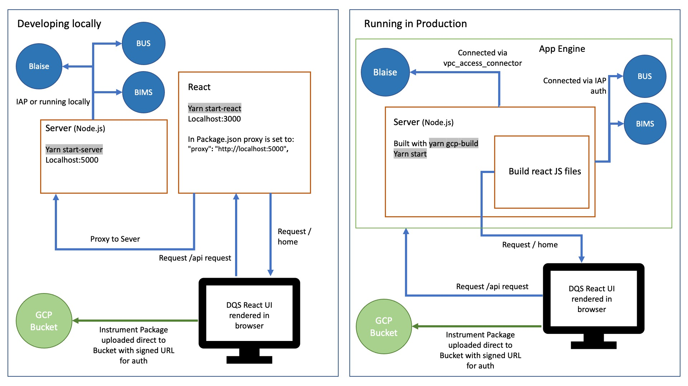

# Blaise Deploy Questionnaire Service (DQS) 🚀

This service provides a web-based user interface for deploying questionnaires to the Blaise platform.

The deployment process allows users to upload a questionnaire package via the UI. The Node.js backend streams this file to a Google Cloud Storage (GCS) bucket, which subsequently triggers a request to the [Blaise REST API](https://github.com/ONSdigital/blaise-api-rest) to finalise the installation.

This project is structured as a React frontend served by an Express backend.



## Architecture and Integrations

During the deployment lifecycle, DQS interacts with several core services to provision the questionnaire:

- **[Blaise Instrument Metadata Service (BIMS)](https://github.com/ONSdigital/blaise-instrument-metadata-service)**: Stores essential metadata for the questionnaire. This includes the Telephone Operations start date utilised by the [Telephone Operations Blaise Interface (TOBI)](https://github.com/ONSdigital/telephone-operations-blaise-interface) and the Totalmobile release date required by [Blaise Totalmobile Services (BTS)](https://github.com/ONSdigital/blaise-totalmobile-services).
- **[Blaise UAC Service (BUS)](https://github.com/ONSdigital/blaise-uac-service)**: Manages the generation and allocation of Unique Access Codes (UACs) required for the questionnaire.


## Local Development Setup

### Prerequisites

Ensure you have the following installed:

- [Node.js](https://nodejs.org/) (Check `package.json` for specific version requirements)
- [Yarn](https://yarnpkg.com/)
- [Google Cloud SDK (`gcloud` CLI)](https://cloud.google.com/sdk/)

### Clone the repository

```shell
git clone https://github.com/ONSdigital/blaise-deploy-questionnaire-service.git
```

### Authenticate with Google Cloud (Keyless)

Local access to BIMS and BUS must use keyless service-account impersonation.


gcloud auth login

gcloud config set project ons-blaise-v2-dev


gcloud iam service-accounts add-iam-policy-binding \
	ons-blaise-v2-dev@appspot.gserviceaccount.com \
	--member="group:gcp-<team-group>@ons.gov.uk" \
	--role="roles/iam.serviceAccountTokenCreator"

gcloud auth application-default login	--impersonate-service-account=ons-blaise-v2-dev@appspot.gserviceaccount.com


### Open a tunnel to the Blaise REST API

To allow your local service to communicate with the Blaise REST API in your sandbox, you must open an Identity-Aware Proxy (IAP) tunnel.

```shell
gcloud compute start-iap-tunnel restapi-1 80 --local-host-port=localhost:8080 --zone europe-west2-a
```

You should see `Listening on port [8080]` in the terminal output. Leave this terminal running in the background.

### Configure Environment Variables

Create a `.env` file in the root of the project. You can find the required IAP Client IDs in the GCP Console by navigating to Security > Identity-Aware Proxy, clicking the three dots next to the relevant service, and selecting Settings.

Alternatively, you can view the configuration of an existing deployment by navigating to App Engine > Versions, selecting the `dqs-ui` service, and clicking View Config.

Example `.env` configuration:

```ini
BIMS_API_URL=https://dev-sandbox123-bims.social-surveys.gcp.onsdigital.uk
BIMS_CLIENT_ID=blah.apps.googleusercontent.com
BLAISE_API_URL=localhost:8080
BUCKET_NAME=ons-blaise-v2-dev-sandbox123-dqs
BUS_API_URL=https://dev-sandbox123-bus.social-surveys.gcp.onsdigital.uk
BUS_CLIENT_ID=blah.apps.googleusercontent.com
CREATE_DONOR_CASES_CLOUD_FUNCTION_URL=https://europe-west2-ons-blaise-v2-dev-sandbox123.cloudfunctions.net/create-donor-cases
GET_USERS_BY_ROLE_CLOUD_FUNCTION_URL=https://europe-west2-ons-blaise-v2-dev-sandbox123.cloudfunctions.net/get-users-by-role
PROJECT_ID=ons-blaise-v2-dev-sandbox123
REISSUE_NEW_DONOR_CASE_CLOUD_FUNCTION_URL=https://europe-west2-ons-blaise-v2-dev-sandbox123.cloudfunctions.net/reissue-new-donor-case
SERVER_PARK=gusty
```

### Install Dependencies

Open a new terminal window (while your IAP tunnel runs in the other) and install the required packages:

```shell
yarn install
```

### Start Service

Start both the Node.js backend server and the React frontend concurrently:

```shell
yarn dev
```

If file watching is unreliable in WSL/mounted paths, use the polling mode:

```shell
yarn dev:wsl
```

For a clean restart that first kills stale listeners/processes on common dev ports:

```shell
yarn dev:clean
```

To stop all local DQS dev processes reliably:

```shell
yarn stop
```

Alias:

```shell
yarn kill
```

The UI will automatically open or be accessible via your browser at:
http://localhost:3000/

### Real-time updates in WSL

`yarn dev` supports live updates for both frontend and backend:

- Frontend: Vite HMR updates the UI instantly on `src/**` changes.
- Backend: TypeScript watch recompiles server files and `node --watch` restarts the API process when compiled output changes.

If file watching seems unreliable under WSL, open the repo from the Linux path (for example `/home/<user>/...`) rather than through a mounted Windows path (`/mnt/c`, `/mnt/d`) for best watch performance.

`yarn dev:wsl` enables polling-based watching for the frontend and can be more reliable on mounted paths.

### Build

Build client + server with pre-build checks (`typecheck` + `publint`):

```shell
yarn build
```

Targeted build scripts:

```shell
yarn build:client
yarn build:server
```

### Validate local BIMS/BUS access

Use these checks to confirm local access is correctly configured before investigating UI errors.

1. Validate token audience matching for BIMS and BUS:

```shell
node --input-type=module -e "import dotenv from 'dotenv'; import {GoogleAuth} from 'google-auth-library'; dotenv.config(); const auth=new GoogleAuth(); const run=async(a)=>{const c=await auth.getIdTokenClient(a); const t=await c.idTokenProvider.fetchIdToken(a); const p=JSON.parse(Buffer.from(t.split('.')[1],'base64url').toString('utf8')); console.log({requested:a,aud:p.aud,email:p.email,match:p.aud===a});}; await run(process.env.BIMS_CLIENT_ID); await run(process.env.BUS_CLIENT_ID);"
```

2. Probe BIMS with a non-existent questionnaire:

```shell
node --input-type=module -e "import dotenv from 'dotenv'; import {getConfigFromEnv} from './dist/src/server/config.js'; import {BimsApi} from './dist/src/server/bimsApi/bimsApi.js'; dotenv.config(); const c=getConfigFromEnv(); const b=new BimsApi(c.BimsApiUrl,c.BimsClientId); b.getReleaseDate('ACCESS_PROBE_DO_NOT_CREATE').then(r=>console.log({bimsReachable:true,result:r??null})).catch(e=>console.log({bimsReachable:false,message:e?.message,status:e?.response?.status,data:e?.response?.data}));"
```

3. Probe BUS with a non-existent instrument:

```shell
node --input-type=module -e "import dotenv from 'dotenv'; import {getConfigFromEnv} from './dist/src/server/config.js'; import { BusClient } from 'blaise-uac-service-node-client'; dotenv.config(); const c=getConfigFromEnv(); const b=new BusClient(c.BusApiUrl,c.BusClientId,15000); Promise.race([b.getUacCodeCount('ACCESS_PROBE_DO_NOT_CREATE'), new Promise((_,rej)=>setTimeout(()=>rej(new Error('timeout')),20000))]).then(r=>console.log({busReachable:true,result:r})).catch(e=>console.log({busReachable:false,message:e?.message,status:e?.response?.status,data:e?.response?.data}));"
```

Expected outcomes:

- Audience checks print `match: true`.
- BIMS probe returns `bimsReachable: true` with `result: null`.
- BUS probe returns `busReachable: true` with `count: 0`.

### Testing

Tests can be run via the following package script:

```shell
yarn test
```
