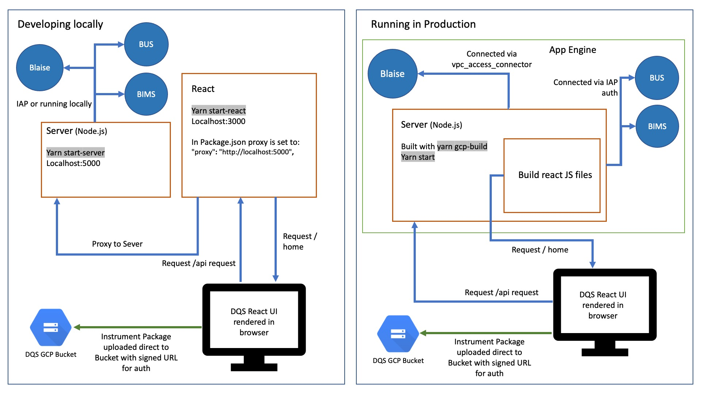
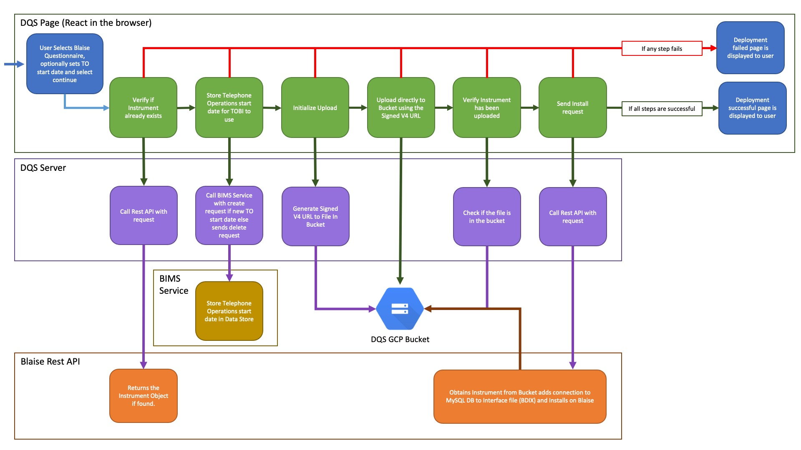

# Blaise Deploy Questionnaire Service (DQS) 🚀

Deploy Questionnaire Service (DQS) provides a web UI for deploying questionnaires to the Blaise platform.

The app is a React frontend served by an Express backend. During deployment, uploaded questionnaire packages are streamed to Google Cloud Storage (GCS), then installed via the [Blaise REST API](https://github.com/ONSdigital/blaise-api-rest).



## Integrations

DQS interacts with the following services during questionnaire deployment and management:

- [Blaise Instrument Metadata Service (BIMS)](https://github.com/ONSdigital/blaise-instrument-metadata-service): Stores questionnaire metadata, including Telephone Operations start date and Totalmobile release date.
- [Telephone Operations Blaise Interface (TOBI)](https://github.com/ONSdigital/telephone-operations-blaise-interface): Uses Telephone Operations start dates configured via DQS/BIMS.
- [Blaise Totalmobile Services (BTS)](https://github.com/ONSdigital/blaise-totalmobile-services): Uses Totalmobile release dates configured via DQS/BIMS.
- [Blaise UAC Service (BUS)](https://github.com/ONSdigital/blaise-uac-service): Generates and manages Unique Access Codes (UACs).



## Local Development

### Prerequisites

- [Node.js](https://nodejs.org/) 24+ (see `engines` in [package.json](package.json))
- [Yarn](https://yarnpkg.com/) 4+
- [Google Cloud SDK (`gcloud` CLI)](https://cloud.google.com/sdk/)

### Clone and install

```shell
git clone https://github.com/ONSdigital/blaise-deploy-questionnaire-service.git
cd blaise-deploy-questionnaire-service
yarn install
```

### Authenticate with Google Cloud (keyless)

Local access to BIMS and BUS uses service account impersonation.

```shell
gcloud auth login
gcloud config set project ons-blaise-v2-dev
gcloud auth application-default login --impersonate-service-account=ons-blaise-v2-dev@appspot.gserviceaccount.com
```

### Start an IAP tunnel to Blaise REST API

Run this in a separate terminal and keep it running:

```shell
gcloud compute start-iap-tunnel restapi-1 80 --local-host-port=localhost:8080 --zone europe-west2-a
```

Expected output includes `Listening on port [8080]`.

### Configure environment variables

Create a `.env` file in the repository root. You can find IAP client IDs from:

- GCP Console -> Security -> Identity-Aware Proxy -> service settings
- Or an existing deployment at App Engine -> Versions -> `dqs-ui` -> View Config

Example `.env`:

```ini
BIMS_API_URL=https://dev-sandbox123-bims.social-surveys.gcp.onsdigital.uk
BIMS_CLIENT_ID=blah.apps.googleusercontent.com
BLAISE_API_URL=localhost:8080
BUCKET_NAME=ons-blaise-v2-dev-sandbox123-dqs
BUS_API_URL=https://dev-sandbox123-bus.social-surveys.gcp.onsdigital.uk
BUS_CLIENT_ID=blah.apps.googleusercontent.com
CREATE_DONOR_CASES_CLOUD_FUNCTION_URL=https://europe-west2-ons-blaise-v2-dev-sandbox123.cloudfunctions.net/create-donor-cases
GET_USERS_BY_ROLE_CLOUD_FUNCTION_URL=https://europe-west2-ons-blaise-v2-dev-sandbox123.cloudfunctions.net/get-users-by-role
PROJECT_ID=ons-blaise-v2-dev-sandbox123
REISSUE_NEW_DONOR_CASE_CLOUD_FUNCTION_URL=https://europe-west2-ons-blaise-v2-dev-sandbox123.cloudfunctions.net/reissue-new-donor-case
SERVER_PARK=gusty
```

### Run the app

Standard mode:

```shell
yarn dev
```

For WSL/mounted paths (polling mode):

```shell
yarn dev-wsl
```

UI is available at http://localhost:3000/.

If local processes become stale, stop known ports and watchers:

```shell
yarn kill
```

## Common Scripts

- `yarn dev`: Run frontend + backend in watch mode
- `yarn dev-wsl`: Run with polling watcher support for WSL/mounted paths
- `yarn build`: Build client and server
- `yarn typecheck`: Run TypeScript checks for frontend and server projects
- `yarn lint`: Run typecheck, ESLint, Prettier checks, and knip
- `yarn lint-fix`: Auto-fix lint/prettier issues and run knip fix
- `yarn test`: Run Vitest suite with coverage
- `yarn test-watch`: Run Vitest in watch mode
- `yarn spellcheck`: Run cspell over code/config/docs files
