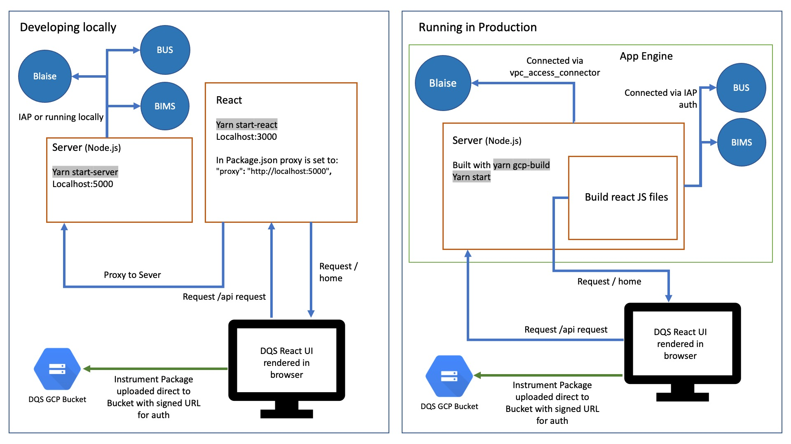

# Blaise Deploy Questionnaire Service (DQS)

This service provides a web user interface for deploying questionnaires to Blaise.

The deployment process involves uploading a questionnaire package to a Google Cloud Storage (GCS) bucket, which then triggers a request to the [Blaise REST API](https://github.com/ONSdigital/blaise-api-rest) to install it.

This project is a React application served by a Node.js Express backend. The backend handles file uploads from the client, streaming them to a GCS bucket using the [@google-cloud/storage](https://www.npmjs.com/package/@google-cloud/storage) package.



### Questionnaire deployment process

This service interacts with several other services:

-   **[Blaise Instrument Metadata Service (BIMS)](https://github.com/ONSdigital/blaise-instrument-metadata-service)**: Stores instrument (questionnaire) metadata, such as the Telephone Operations start date used by the [Telephone Operations Blaise Interface (TOBI)](https://github.com/ONSdigital/telephone-operations-blaise-interface) and The Totalmobile release date used by [Blaise Totalmobile Services (BTS)](https://github.com/ONSdigital/blaise-totalmobile-services).
-   **[Blaise UAC Service (BUS)](https://github.com/ONSdigital/blaise-uac-service)**: Manages the generation of Unique Access Codes (UACs) for questionnaires.


### Local Development Setup

Prerequisites:

- [Node.js](https://nodejs.org/)
- [Yarn](https://yarnpkg.com/)
- [Cloud SDK](https://cloud.google.com/sdk/)

Clone the repository:

```shell
git clone https://github.com/ONSdigital/blaise-deploy-questionnaire-service.git
```

Authenticate with GCP:

```shell
gcloud auth login
```

Set your GCP project:

```shell
gcloud config set project ons-blaise-v2-dev-<sandbox-suffix>
```

Open a tunnel to our Blaise RESTful API in your GCP project:

```shell
gcloud compute start-iap-tunnel restapi-1 80 --local-host-port=localhost:8080 --zone europe-west2-a
```

You should see `Listening on port [8080]` in the terminal output, leave this terminal running.

Create an .env file in the project root with the following variables:

| Variable | Description | Example |
| - | - | - |
| BLAISE_API_URL | Local address you have the [Blaise Rest API](https://github.com/ONSdigital/blaise-api-rest) running on | localhost:8080 |
| PROJECT_ID | GCP project ID | ons-blaise-dev-sandbox123 |
| BUCKET_NAME | Bucket questionnaire will be uploaded to | ons-blaise-dev-sandbox123-dqs |
| SERVER_PARK | Blaise server park questionnaires are deployed in | gusty |
| BIMS_API_URL | Address for [BIMS](https://github.com/ONSdigital/blaise-instrument-metadata-service) | https://dev-sandbox123-bims.social-surveys.gcp.onsdigital.uk |
| BIMS_CLIENT_ID | IAP client ID for [BIMS](https://github.com/ONSdigital/blaise-instrument-metadata-service) | blah.apps.googleusercontent.com |
| BUS_API_URL | Address for [BUS](https://github.com/ONSdigital/blaise-uac-service) | https://dev-sandbox123-bus.social-surveys.gcp.onsdigital.uk |
| BUS_CLIENT_ID | IAP client ID for [BUS](https://github.com/ONSdigital/blaise-uac-service)| blah.apps.googleusercontent.com |
| CREATE_DONOR_CASES_CLOUD_FUNCTION_URL | Address to trigger create donor cases cloud function | https://europe-west2-ons-blaise-v2-dev-sandbox123.cloudfunctions.net/create-donor-cases |
| REISSUE_NEW_DONOR_CASE_CLOUD_FUNCTION_URL | Address to trigger reissue new donor case cloud function | https://europe-west2-ons-blaise-v2-dev-sandbox123.cloudfunctions.net/reissue-new-donor-case |
| GET_USERS_BY_ROLE_CLOUD_FUNCTION_URL | Address to trigger get users by role cloud function | https://europe-west2-ons-blaise-v2-dev-sandbox123.cloudfunctions.net/get-users-by-role |

To find the IAP client IDs, navigate to the GCP console, search for `IAP`, click the three dots to the right of the service and select `Settings`.

Environment variables for DQS that has already been deployed to an environment can also be found by going to the GCP console, searching for `App Engine`, clicking `Versions`, selecting `dqs-ui`, then clicking `View` under `Config`.

Example .env file:

```ini 
BLAISE_API_URL=localhost:8080
PROJECT_ID=ons-blaise-v2-dev-sandbox123
BUCKET_NAME=ons-blaise-v2-dev-sandbox123-dqs
SERVER_PARK=gusty
BIMS_API_URL=https://dev-sandbox123-bims.social-surveys.gcp.onsdigital.uk
BIMS_CLIENT_ID=blah.apps.googleusercontent.com
BUS_API_URL=https://dev-sandbox123-bus.social-surveys.gcp.onsdigital.uk
BUS_CLIENT_ID=blah.apps.googleusercontent.com
CREATE_DONOR_CASES_CLOUD_FUNCTION_URL=https://europe-west2-ons-blaise-v2-dev-sandbox123.cloudfunctions.net/create-donor-cases
REISSUE_NEW_DONOR_CASE_CLOUD_FUNCTION_URL=https://europe-west2-ons-blaise-v2-dev-sandbox123.cloudfunctions.net/reissue-new-donor-case
GET_USERS_BY_ROLE_CLOUD_FUNCTION_URL=https://europe-west2-ons-blaise-v2-dev-sandbox123.cloudfunctions.net/get-users-by-role
```

In a new terminal, install the JavaScript dependencies:

```shell
yarn
```

Create service account JSON key.

```shell

gcloud iam service-accounts keys create keys.json --iam-account ons-blaise-v2-dev-<sandbox>@appspot.gserviceaccount.com
```

Set temporary environment variable for service account key.

```shell
export GOOGLE_APPLICATION_CREDENTIALS=keys.json
```

Run Node.js server and React.js client via the following package.json script:

```shell script
yarn dev
```

The UI should now be accessible via:

http://localhost:3000/

Tests can be run via the following package.json script:

```shell script
yarn test
```

Test snapshots can be updated via:

```shell script
yarn test -u
```
